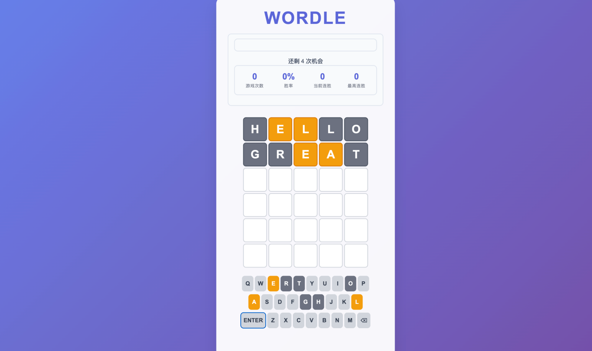

# 🚀 JavaScript 学习笔记与项目实践

欢迎来到我的 JavaScript 学习天地！这里包含了从基础语法到高级特性的完整学习笔记，以及一个功能完整的 Wordle 游戏项目实践。

## 📚 目录导航

### 🎯 学习笔记
- JavaScript 基础
- 高级 JavaScript
- 项目实践：Wordle 游戏

### 🎮 项目展示





---

## 📖 JavaScript 基础

### 1. 基础语法 (`blogs/javascript/01-基础语法.md`)

**核心概念：**
- **变量声明**：`let`、`const`、`var` 的区别和使用场景
- **数据类型**：基本类型和引用类型的详细解析
- **模板字符串**：现代字符串处理方式
- **类型转换**：自动转换和强制转换的规则

**实用示例：**
```javascript
// 现代变量声明方式
let name = "张三";
const age = 25;
const isStudent = true;

// 模板字符串
const greeting = `你好，${name}！你今年${age}岁。`;

// 解构赋值
const [a, b, c] = [1, 2, 3];
const {name, age} = person;
```

### 2. 函数与作用域 (`blogs/javascript/02-函数与作用域.md`)

**深入理解：**
- **函数声明**：函数声明、函数表达式、箭头函数
- **作用域链**：词法作用域和动态作用域
- **执行上下文**：全局上下文、函数上下文、eval 上下文
- **this 指向**：this 在不同场景下的绑定规则

**核心示例：**
```javascript
// 箭头函数与普通函数的区别
const obj = {
    name: '张三',
    regularFunc: function() {
        console.log(this.name); // 张三
    },
    arrowFunc: () => {
        console.log(this.name); // undefined
    }
};

// 闭包与作用域
function createCounter() {
    let count = 0;
    return function() {
        return ++count;
    };
}
```

### 3. 异步编程深度解析 (`blogs/javascript/03-异步编程深度解析.md`)

**异步处理全攻略：**
- **Promise**：现代异步编程的基础
- **async/await**：异步代码的同步写法
- **事件循环**：JavaScript 异步编程的核心机制
- **错误处理**：异步代码中的异常捕获策略

**实战示例：**
```javascript
// Promise 链式调用
fetch('/api/data')
    .then(response => response.json())
    .then(data => console.log(data))
    .catch(error => console.error('Error:', error));

// async/await 语法
async function fetchData() {
    try {
        const response = await fetch('/api/data');
        const data = await response.json();
        return data;
    } catch (error) {
        console.error('Error:', error);
    }
}

// 并发处理
Promise.all([fetchData1(), fetchData2(), fetchData3()])
    .then(results => console.log(results));
```

### 4. 原型链与面向对象编程 (`blogs/javascript/04-原型链与面向对象编程.md`)

**面向对象编程：**
- **原型链**：JavaScript 对象继承的核心机制
- **构造函数**：创建对象的模板
- **class 语法**：ES6+ 的类定义方式
- **继承与多态**：代码复用的实现方式

**实现示例：**
```javascript
// 原型链继承
function Animal(name) {
    this.name = name;
}
Animal.prototype.speak = function() {
    console.log(`${this.name} makes a sound`);
};

// ES6 Class 语法
class Dog extends Animal {
    constructor(name, breed) {
        super(name);
        this.breed = breed;
    }

    speak() {
        console.log(`${this.name} barks`);
    }
}
```

### 5. 闭包与高阶函数 (`blogs/javascript/05-闭包与高阶函数.md`)

**函数式编程精髓：**
- **闭包原理**：词法作用域的延伸应用
- **高阶函数**：函数作为参数和返回值
- **纯函数**：无副作用、可预测的函数
- **函数组合**：构建复杂函数的方法

**高级应用：**
```javascript
// 闭包实现私有变量
function createBankAccount(initialBalance) {
    let balance = initialBalance;

    return {
        deposit: function(amount) {
            balance += amount;
            return balance;
        },
        withdraw: function(amount) {
            if (balance >= amount) {
                balance -= amount;
                return balance;
            }
            throw new Error('Insufficient funds');
        },
        getBalance: function() {
            return balance;
        }
    };
}

// 高阶函数：函数组合
const compose = (f, g) => x => f(g(x));
const add1 = x => x + 1;
const multiply2 = x => x * 2;
const add1ThenMultiply2 = compose(multiply2, add1);
```

---

## 🔬 高级 JavaScript

### 1. JavaScript 引擎工作原理深度解析 (`blogs/advanced-javascript/01-JavaScript引擎工作原理深度解析.md`)

**引擎内部机制：**
- **解析器**：词法分析和语法树构建
- **解释器**：字节码生成和执行
- **编译器**：即时编译（JIT）优化
- **垃圾回收**：内存管理机制

**性能优化策略：**
```javascript
// 优化前的代码
function sumArray(arr) {
    let sum = 0;
    for (let i = 0; i < arr.length; i++) {
        sum += arr[i];
    }
    return sum;
}

// 优化后的代码（利用引擎优化）
function sumArrayOptimized(arr) {
    let sum = 0;
    const length = arr.length; // 缓存长度属性
    for (let i = 0; i < length; i++) {
        sum += arr[i]; // 单态调用优化
    }
    return sum;
}
```

### 2. V8 引擎优化机制深度解析 (`blogs/advanced-javascript/02-V8引擎优化机制深度解析.md`)

**V8 引擎特性：**
- **隐藏类**：对象的快速属性访问
- **内联缓存**：方法调用的优化技术
- **逃逸分析**：对象分配优化
- **代码优化**：热点代码的 JIT 编译

**优化实战：**
```javascript
// 隐藏类友好的对象创建
function Point(x, y) {
    this.x = x;
    this.y = y;
}

// 保持对象形状一致
const points = [];
for (let i = 0; i < 1000; i++) {
    points.push(new Point(i, i * 2));
}

// 避免在运行时删除属性（会破坏隐藏类）
// bad: delete point.x;
// good: point.x = undefined;
```

### 3. 内存管理与垃圾回收深度解析 (`blogs/advanced-javascript/03-内存管理与垃圾回收深度解析.md`)

**内存管理策略：**
- **垃圾回收算法**：标记清除、引用计数
- **内存泄漏**：常见原因和预防措施
- **性能监控**：内存使用分析和优化
- **最佳实践**：高效内存使用模式

**内存优化示例：**
```javascript
// 避免内存泄漏
class EventEmitter {
    constructor() {
        this.events = {};
        this.maxListeners = 10;
    }

    on(event, listener) {
        if (!this.events[event]) {
            this.events[event] = [];
        }
        this.events[event].push(listener);

        // 防止内存泄漏
        if (this.events[event].length > this.maxListeners) {
            console.warn(`Possible memory leak detected. ${this.events[event].length} ${event} listeners attached.`);
        }
    }

    // 记得在不需要时移除监听器
    off(event, listenerToRemove) {
        if (!this.events[event]) return;
        this.events[event] = this.events[event].filter(listener => listener !== listenerToRemove);
    }
}
```

### 4. 并发编程与 Web Workers 深度解析 (`blogs/advanced-javascript/04-并发编程与Web Workers深度解析.md`)

**并发处理技术：**
- **Web Workers**：多线程 JavaScript 编程
- **SharedArrayBuffer**：共享内存操作
- **消息传递**：线程间通信机制
- **性能优化**：CPU 密集型任务的并行处理

**Web Worker 实战：**
```javascript
// 主线程代码
const worker = new Worker('worker.js');

worker.postMessage({
    type: 'calculate',
    data: largeDataSet
});

worker.onmessage = function(event) {
    console.log('Worker result:', event.data);
};

// worker.js
self.onmessage = function(event) {
    if (event.data.type === 'calculate') {
        const result = heavyCalculation(event.data.data);
        self.postMessage(result);
    }
};

function heavyCalculation(data) {
    // CPU 密集型计算
    return data.map(item => complexOperation(item));
}
```

### 5. 性能优化与调试技巧深度解析 (`blogs/advanced-javascript/05-性能优化与调试技巧深度解析.md`)

**性能优化方法：**
- **代码分割**：按需加载和懒加载
- **缓存策略**：浏览器缓存和应用缓存
- **网络优化**：资源加载和传输优化
- **调试工具**：Chrome DevTools 高级使用

**性能监控：**
```javascript
// 性能监控 API
const performance = {
    start: function(label) {
        performance.mark(`${label}-start`);
    },

    end: function(label) {
        performance.mark(`${label}-end`);
        performance.measure(label, `${label}-start`, `${label}-end`);
        const measures = performance.getEntriesByName(label);
        const duration = measures[0].duration;
        console.log(`${label}: ${duration.toFixed(2)}ms`);
        performance.clearMarks();
        performance.clearMeasures();
    }
};

// 使用示例
performance.start('data-processing');
// ... 执行代码
performance.end('data-processing');
```

### 6. 元编程与 Proxy 应用深度解析 (`blogs/advanced-javascript/06-元编程与Proxy应用深度解析.md`)

**元编程技术：**
- **Proxy 对象**：对象行为拦截和自定义
- **Reflect API**：元编程的工具函数
- **Symbol**：元编程的特殊标识符
- **装饰器模式**：元编程的设计模式应用

**Proxy 实战应用：**
```javascript
// 数据验证 Proxy
const validationProxy = new Proxy({}, {
    set: function(target, property, value) {
        if (property === 'age' && typeof value !== 'number') {
            throw new Error('Age must be a number');
        }
        if (property === 'name' && typeof value !== 'string') {
            throw new Error('Name must be a string');
        }
        target[property] = value;
        return true;
    }
});

// API 请求拦截器
const apiProxy = new Proxy({}, {
    get: function(target, property) {
        return function(...args) {
            console.log(`API call: ${property}`, args);
            return fetch(`/api/${property}`, {
                method: 'POST',
                headers: {
                    'Content-Type': 'application/json',
                },
                body: JSON.stringify(args[0])
            });
        };
    }
});
```

---

## 🎮 Wordle 游戏

### 项目概述

本项目是一个功能完整的 Wordle 游戏，采用现代 JavaScript 开发，具有以下特点：

- **🎯 完整游戏逻辑**：标准 Wordle 游戏规则实现
- **🎨 现代化界面**：响应式设计，流畅动画效果
- **⌨️ 双重输入**：支持虚拟键盘和实体键盘
- **📊 统计系统**：游戏数据统计和成就系统
- **🧪 完整测试**：125 项测试覆盖，确保代码质量

### 技术栈

- **前端框架**：原生 JavaScript (ES6+)
- **构建工具**：Vite
- **测试框架**：Jest
- **样式**：CSS3 + 动画效果
- **架构**：模块化组件设计

### 项目结构

```
wordle-game/
├── src/
│   ├── js/
│   │   ├── WordleGame.js          # 核心游戏逻辑
│   │   ├── WordValidator.js       # 单词验证系统
│   │   ├── GameStateManager.js    # 状态管理
│   │   ├── GameBoard.js           # 游戏棋盘 UI
│   │   ├── VirtualKeyboard.js     # 虚拟键盘
│   │   ├── GameStats.js           # 统计组件
│   │   ├── WordleController.js    # 主控制器
│   │   └── index.js               # 入口文件
│   ├── css/
│   │   └── style.css              # 样式文件
│   └── index.html                 # 主页面
├── tests/                         # 测试文件
├── test-*.js                      # 测试运行器
└── README.md                      # 项目文档
```

### 核心功能

#### 1. 游戏逻辑 (`WordleGame.js`)
```javascript
export class WordleGame {
    constructor(wordList = []) {
        this.wordList = wordList;
        this.targetWord = '';
        this.currentGuess = '';
        this.guesses = [];
        this.maxGuesses = 6;
        this.wordLength = 5;
        this.gameStatus = 'playing';
    }

    addLetter(letter) {
        if (this.currentGuess.length < this.wordLength) {
            this.currentGuess += letter.toUpperCase();
            return true;
        }
        return false;
    }

    submitGuess() {
        if (this.currentGuess.length === this.wordLength) {
            const result = this.evaluateGuess(this.currentGuess);
            this.guesses.push({ word: this.currentGuess, result });
            this.currentGuess = '';
            this.checkGameStatus();
            return true;
        }
        return false;
    }
}
```

#### 2. 单词验证系统 (`WordValidator.js`)
```javascript
export class WordValidator {
    constructor() {
        this.validWords = new Set();
        this.commonWords = new Set([
            'ABOUT', 'ABOVE', 'ABUSE', 'ACTOR', 'ACUTE', 'ADMIT', 'ADOPT', 'ADULT',
            'AFTER', 'AGAIN', 'AGENT', 'AGREE', 'AHEAD', 'ALARM', 'ALBUM', 'ALERT',
            // ... 500+ 常用英文单词
        ]);
        this.commonWords.forEach(word => this.validWords.add(word));
    }

    validateWord(word) {
        if (typeof word !== 'string') {
            return { valid: false, reason: '单词必须是字符串' };
        }

        if (word.length !== 5) {
            return { valid: false, reason: '单词必须是5个字母' };
        }

        if (!/^[A-Z]{5}$/.test(word)) {
            return { valid: false, reason: '单词只能包含字母' };
        }

        if (!this.validWords.has(word)) {
            return { valid: false, reason: '不是有效的英文单词' };
        }

        return { valid: true };
    }
}
```

#### 3. 状态管理 (`GameStateManager.js`)
```javascript
export class GameStateManager {
    constructor() {
        this.state = {
            currentGame: null,
            gameHistory: [],
            statistics: {
                gamesPlayed: 0,
                gamesWon: 0,
                currentStreak: 0,
                maxStreak: 0,
                guessDistribution: [0, 0, 0, 0, 0, 0]
            },
            settings: {
                darkTheme: false,
                animations: true,
                hardMode: false
            },
            achievements: [],
            lastPlayed: null
        };
        this.loadState();
    }

    submitGuess(word) {
        const result = this.game.evaluateGuess(word, this.game.targetWord);
        this.game.guesses.push({ word, result });

        // 更新统计
        this.state.statistics.gamesPlayed++;
        this.state.statistics.guessDistribution[this.game.guesses.length - 1]++;

        if (this.game.gameStatus === 'won') {
            this.state.statistics.gamesWon++;
            this.state.statistics.currentStreak++;
            this.state.statistics.maxStreak = Math.max(
                this.state.statistics.maxStreak,
                this.state.statistics.currentStreak
            );
        } else {
            this.state.statistics.currentStreak = 0;
        }

        this.saveState();
        return result;
    }
}
```

### 游戏特色

#### 1. 双重输入支持
- **虚拟键盘**：点击屏幕键盘输入
- **实体键盘**：直接使用物理键盘输入
- **快捷键支持**：Enter 提交，Backspace 删除

#### 2. 视觉效果
- **动画反馈**：字母输入、提交、结果展示动画
- **颜色编码**：绿色（正确）、黄色（位置错误）、灰色（不存在）
- **响应式设计**：适配各种屏幕尺寸

#### 3. 统计系统
- **游戏统计**：总游戏次数、胜率、连胜记录
- **猜测分布**：显示在不同尝试次数完成游戏的分布
- **成就系统**：解锁各种游戏成就

### 测试覆盖

项目包含 125 项测试，确保代码质量：

```
测试类别                通过    失败    总计
-----------------------------------------
核心游戏逻辑单元测试         12       0      12
单词验证单元测试             19       0      19
状态管理单元测试             18       0      18
UI组件单元测试               41       0      41
集成测试                     35       0      35
-----------------------------------------
总计                       125       0     125
```

### 启动游戏

```bash
# 进入项目目录
cd wordle-game

# 安装依赖
npm install

# 启动开发服务器
npm run dev
```

游戏将在 `http://localhost:3000` 启动，支持以下操作：

- **输入字母**：使用键盘或点击虚拟键盘
- **提交单词**：按 Enter 键或点击提交按钮
- **删除字母**：按 Backspace 键或点击删除按钮
- **新游戏**：点击"新游戏"按钮

### 游戏规则

1. **目标**：在 6 次机会内猜出 5 个字母的英文单词
2. **输入**：使用虚拟键盘或实体键盘输入字母
3. **提交**：输入 5 个字母后按 Enter 提交
4. **反馈**：
   - 🟩 绿色：字母正确且位置正确
   - 🟨 黄色：字母正确但位置错误
   - ⬜ 灰色：字母不在目标单词中

### 学习价值

这个项目不仅是一个有趣的游戏，更是一个完整的 JavaScript 学习案例：

- **模块化设计**：展示如何组织大型 JavaScript 应用
- **状态管理**：复杂应用状态的管理模式
- **测试驱动开发**：完整的测试覆盖和开发流程
- **用户体验**：现代化交互设计
- **性能优化**：高效的代码实现和优化策略

### 代码质量指标

- **测试覆盖率**：125 项单元测试和集成测试
- **代码模块化**：8 个独立的功能模块
- **ES6+ 语法**：使用现代 JavaScript 特性
- **错误处理**：完善的异常处理机制
- **性能优化**：JIT 友好的代码实现

---

## 🚀 快速开始

### 环境要求

- Node.js 16+
- npm 或 yarn
- 现代浏览器（支持 ES6+）

### 项目启动

```bash
# 克隆项目
git clone [项目地址]
cd tiny-javascript

# 启动 Wordle 游戏
cd wordle-game
npm install
npm run dev

# 游戏将在 http://localhost:5173 启动
```

### 学习路线建议

1. **基础语法** → **函数与作用域** → **异步编程**
2. **原型链与面向对象** → **闭包与高阶函数**
3. **JavaScript 引擎原理** → **V8 优化机制**
4. **内存管理** → **并发编程** → **性能优化**
5. **元编程** → **项目实践（Wordle 游戏）**

### 实践项目

建议按照以下顺序进行实践：

1. **基础练习**：使用基础语法实现简单的 DOM 操作
2. **异步应用**：使用 async/await 实现数据加载
3. **面向对象**：使用 class 语法构建组件系统
4. **函数式编程**：使用高阶函数实现数据处理
5. **完整项目**：参考 Wordle 游戏实现自己的项目

---

## 📈 项目统计

### 技术内容覆盖
- **基础 JavaScript**：5 篇详细教程
- **高级 JavaScript**：6 篇深度解析
- **代码示例**：300+ 实用代码片段
- **实战项目**：1 个完整的 Wordle 游戏

### 项目特色
- **理论与实践结合**：每个概念都有对应的代码示例
- **循序渐进**：从基础语法到高级特性的完整学习路径
- **现代 JavaScript**：使用 ES6+ 语法和最佳实践
- **项目驱动**：通过实际项目巩固所学知识

## 📞 联系方式

如有问题或建议，欢迎交流讨论！

---

*🎉 祝你学习愉快，编程进步！*