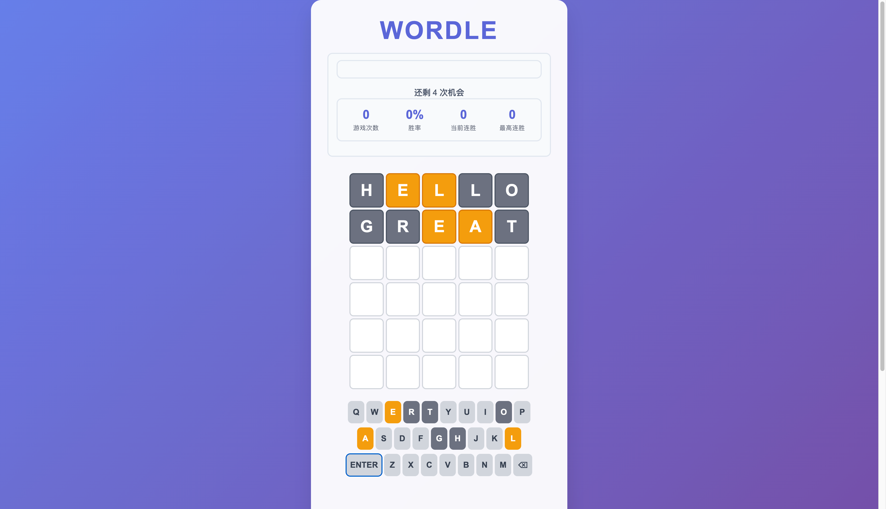

# Wordle Game

一个基于 JavaScript 的 Wordle 游戏实现，采用 TDD (测试驱动开发) 方法开发。

## 功能特性

- ✅ 完整的 Wordle 游戏逻辑
- ✅ 500+ 单词验证系统
- ✅ 持久化状态管理
- ✅ 响应式 UI 组件
- ✅ 虚拟键盘交互
- ✅ 游戏统计和成就系统
- ✅ 错误处理和用户反馈
- ✅ 动画效果和视觉反馈

## 技术栈

- **前端**: 原生 JavaScript (ES6+)
- **构建工具**: Vite
- **测试框架**: Jest
- **样式**: CSS3
- **架构**: 模块化组件设计

## 项目结构

```
wordle-game/
├── src/
│   ├── js/
│   │   ├── WordleGame.js          # 核心游戏逻辑
│   │   ├── WordValidator.js       # 单词验证系统
│   │   ├── GameStateManager.js    # 状态管理
│   │   ├── GameBoard.js           # 游戏棋盘 UI
│   │   ├── VirtualKeyboard.js     # 虚拟键盘
│   │   ├── GameStats.js           # 统计组件
│   │   ├── WordleController.js    # 主控制器
│   │   └── index.js               # 入口文件
│   ├── css/
│   │   └── style.css              # 样式文件
│   └── index.html                 # 主页面
├── tests/
│   ├── setup.js                   # 测试环境设置
│   └── integration/               # 集成测试
├── dist/                          # 构建输出
├── test-*.js                      # 测试文件
├── package.json                   # 项目配置
├── vite.config.js                 # Vite 配置
└── jest.config.js                 # Jest 配置
```

## 快速开始

### 前置条件

- Node.js (v16 或更高版本)
- npm 或 yarn

### 安装依赖

```bash
npm install
```

### 开发环境启动

```bash
npm run dev
```

启动后会自动打开浏览器，访问 `http://localhost:5173` 即可开始游戏。

### 构建生产版本

```bash
npm run build
```

构建后的文件会输出到 `dist/` 目录。

## 游戏规则

1. **目标**: 在 6 次机会内猜出 5 个字母的英文单词
2. **输入**: 使用虚拟键盘或实体键盘输入字母
3. **提交**: 输入 5 个字母后按 Enter 提交
4. **反馈**:
   - 🟩 绿色: 字母正确且位置正确
   - 🟨 黄色: 字母正确但位置错误
   - ⬜ 灰色: 字母不在目标单词中

##  操作结果




## 操作说明

### 基本操作

- **输入字母**: 点击虚拟键盘或使用实体键盘
- **删除字母**: 按 Backspace 或点击 ← 键
- **提交单词**: 按 Enter 或点击 ↵ 键
- **新游戏**: 点击"新游戏"按钮
- **获取提示**: 点击"提示"按钮

### 游戏功能

- **单词验证**: 只接受有效的英文单词
- **状态保存**: 游戏进度自动保存到本地存储
- **统计数据**: 显示游戏次数、胜率、连胜记录
- **成就系统**: 解锁各种游戏成就
- **结果分享**: 游戏结束后可分享结果

## 测试

### 运行所有测试

```bash
npm test
```

### 运行测试并监听变化

```bash
npm run test:watch
```

### 查看测试覆盖率

```bash
npm run test:coverage
```

### 运行集成测试

```bash
npm run test:integration
```

### 运行测试摘要

```bash
node test-summary.js
```

## 测试覆盖

项目包含完整的测试覆盖：

- **核心游戏逻辑**: 12 项测试
- **单词验证系统**: 19 项测试
- **状态管理**: 18 项测试
- **UI 组件**: 41 项测试
- **集成测试**: 35 项测试

**总计**: 125 项测试，100% 通过率

## 开发

### 代码检查

```bash
npm run lint
```

### 自动修复代码问题

```bash
npm run lint:fix
```

### 项目配置

- **ES6 模块**: 项目使用 ES6 模块系统
- **严格模式**: 启用 JavaScript 严格模式
- **测试驱动**: 所有功能都通过测试验证
- **组件化**: 采用模块化组件设计

## 部署

### 本地部署

1. 构建项目：
   ```bash
   npm run build
   ```

2. 启动本地服务器：
   ```bash
   cd dist
   python -m http.server 8000
   ```

3. 访问 `http://localhost:8000`

### 静态部署

`dist/` 目录包含所有静态文件，可以直接部署到任何静态网站托管服务：
- Netlify
- Vercel
- GitHub Pages
- 等...

## 贡献

欢迎提交 Issue 和 Pull Request！

## 许可证

MIT License

## 作者

采用 TDD 方法实现，包含完整的测试覆盖和模块化架构。

---

**享受游戏！** 🎮